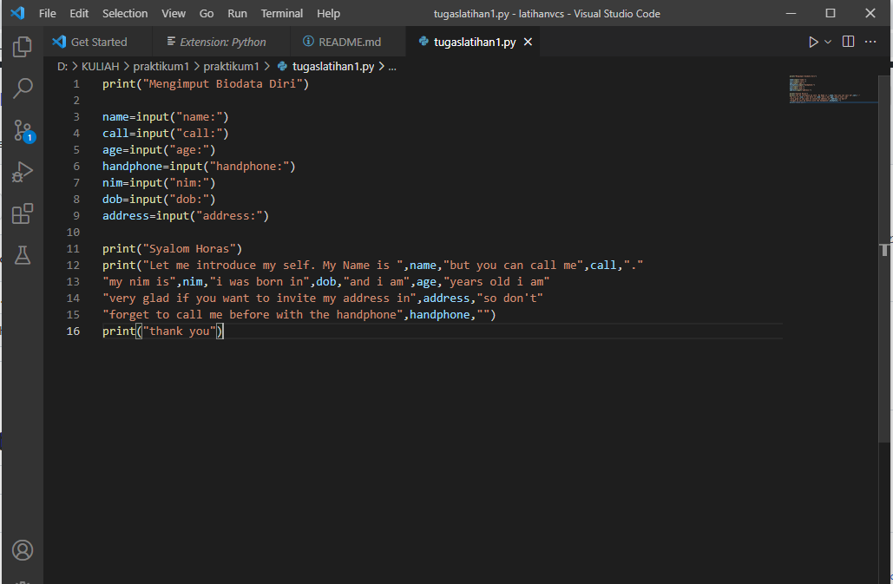
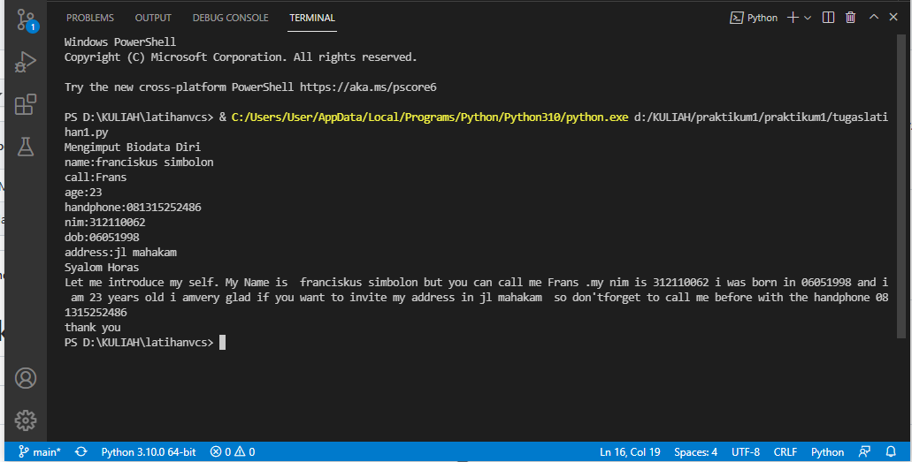

# praktikum
## Nama : Franciskus Simbolon
### Nim : 312110062
#### Tugas Bahasa Pemrograman

Membuat Program Biodata

ketik script seperti contoh berikut

Proses sesudah running setelah 

kita mengiput data 

