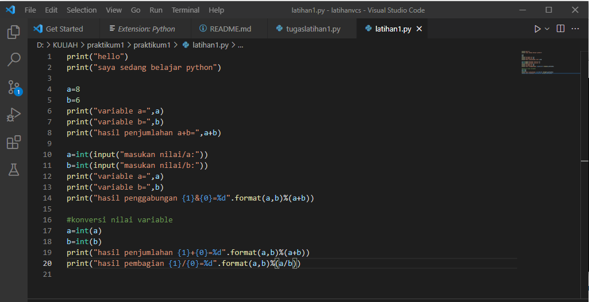
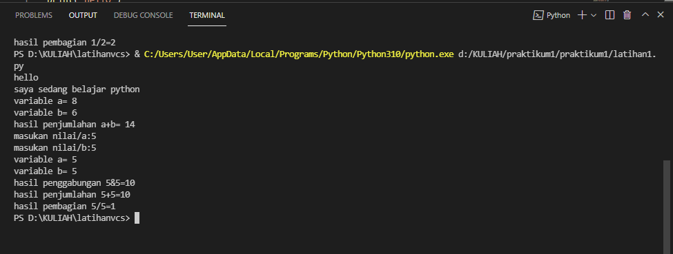

# praktikum
## Nama : Franciskus Simbolon
### Nim : 312110062
#### Tugas Bahasa Pemrograman

Membuat Program Biodata

ketik script seperti contoh berikut

Proses sesudah running setelah 

kita mengiput data 

Membuat Program penjumlahan dan pembagian 

Seperti cotoh berikut 

Ketika dirunning input angka yang diinginkan 

Terimakasih.